# Planar Network Diversion

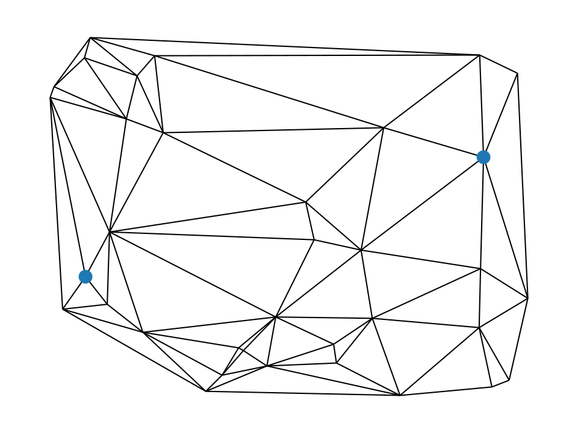{ width=40% } \hfill
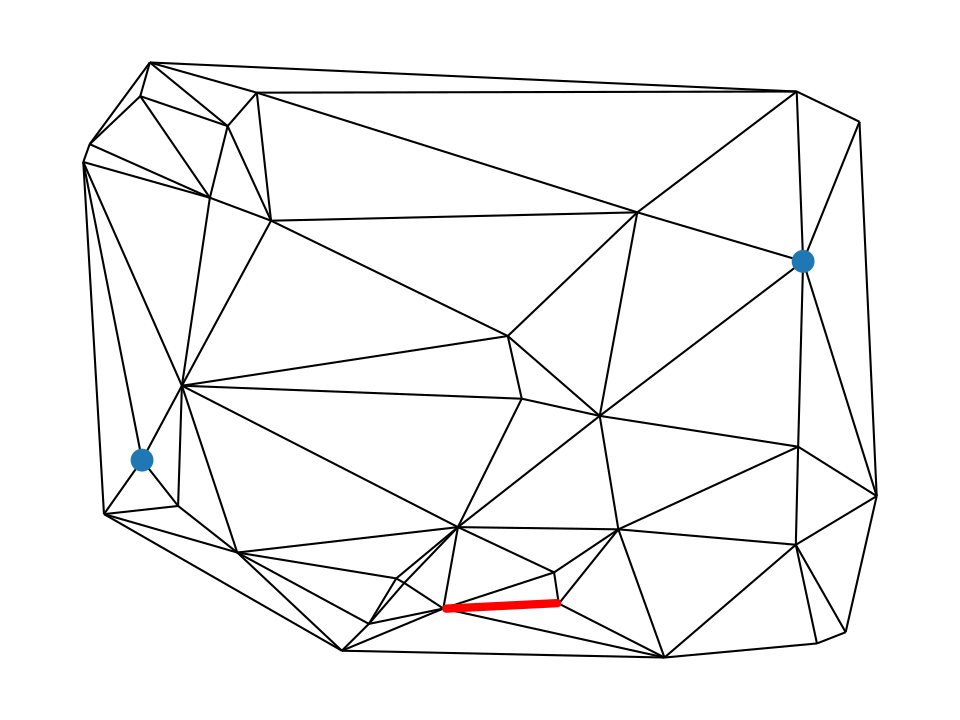{ width=40% }

::: columns
:::: column

Pål Grønås Drange

\smallskip

\scriptsize

_University of Bergen_

February 21, 2025

\medskip

\tiny

Joint work with

* Matthias Bentert
* Fedor V. Fomin
* Steinar Simonnes

::::
:::: column

* \textsc{Minimum $s$-$t$-Cuts}
* \textsc{Network Diversion}
  * Planar case: $O(n \log n)$
  * Directed: NP-complete
  * Undirected: Open

::::
:::

# Cut -- Cycle space duality

{ width=30% }
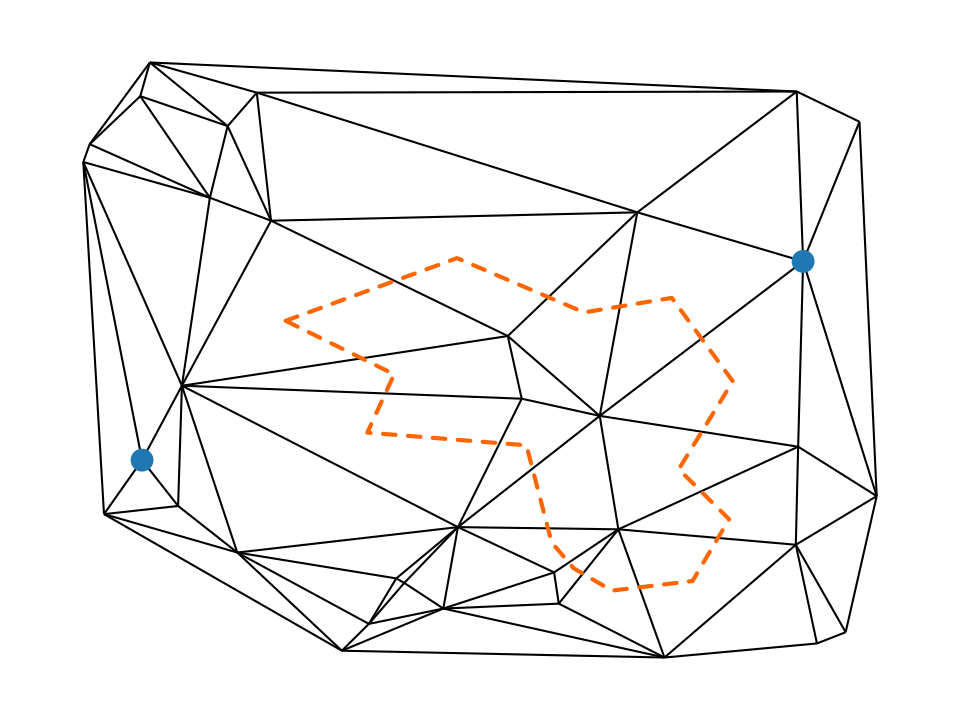{ width=30% }
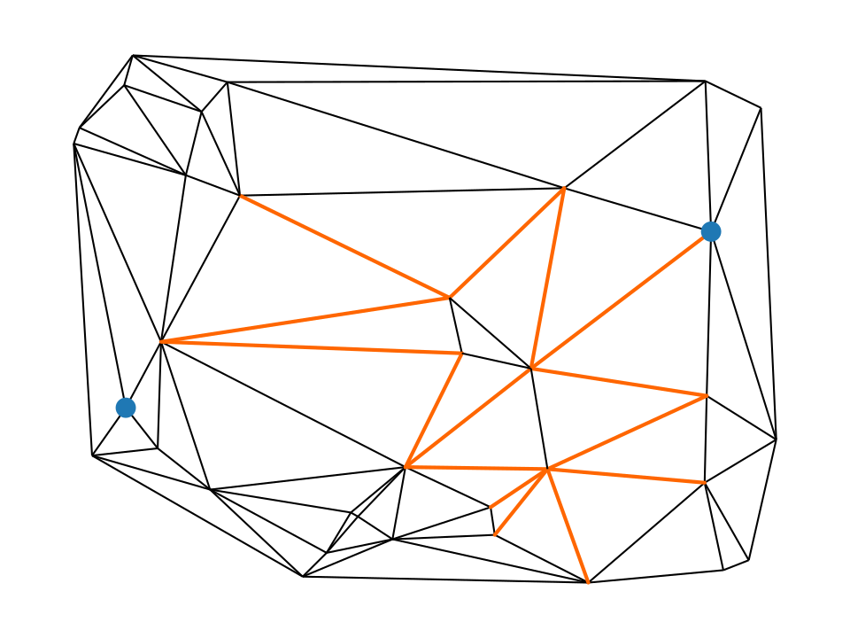{ width=30% }

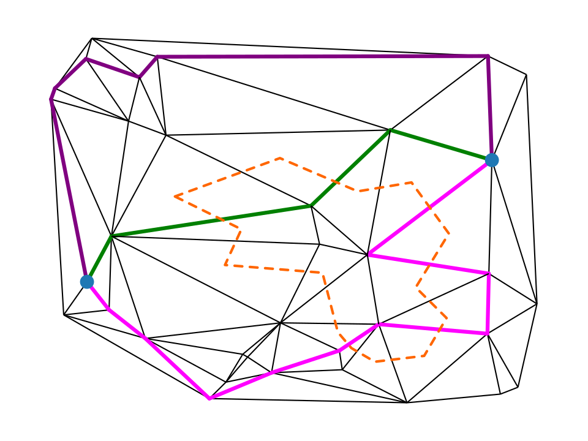{ width=30% }
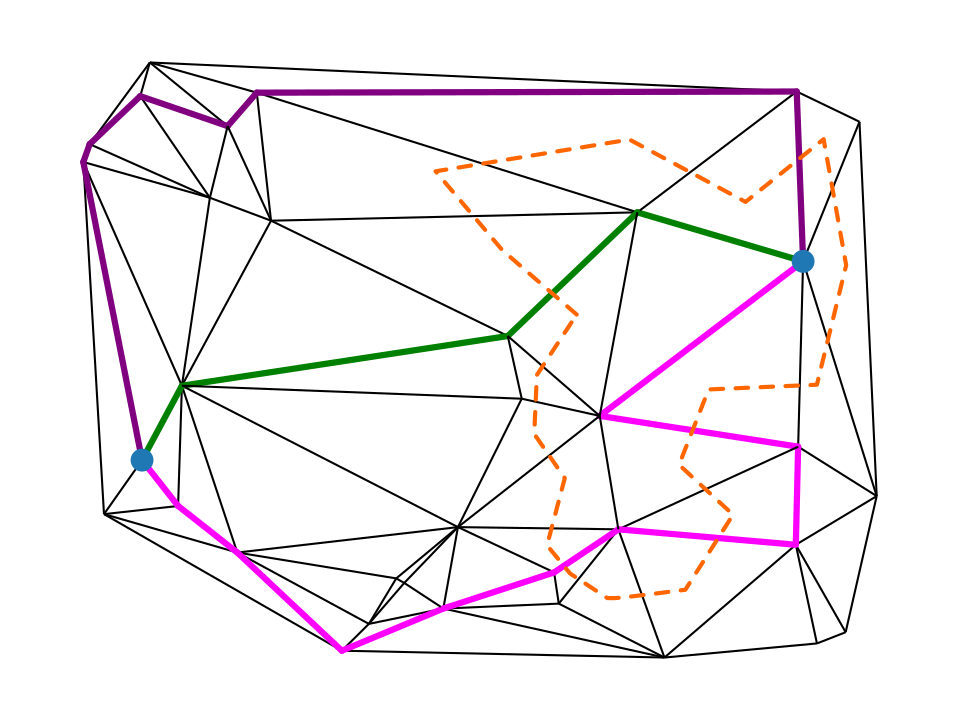{ width=30% }
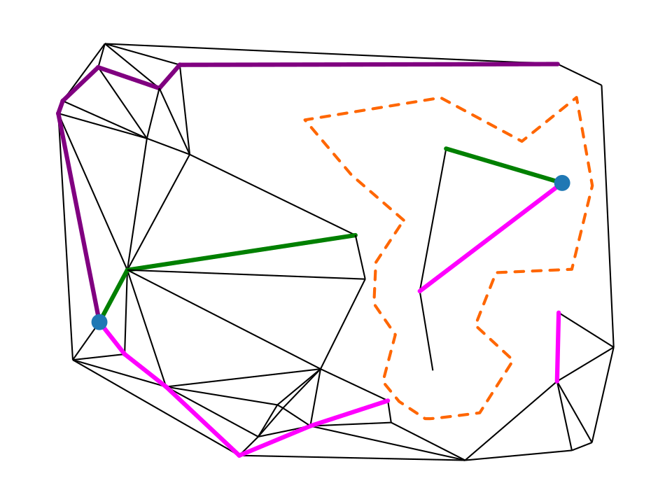{ width=30% }

# Algorithm: Planar Network Diversion

{ width=30% }
{ width=30% }
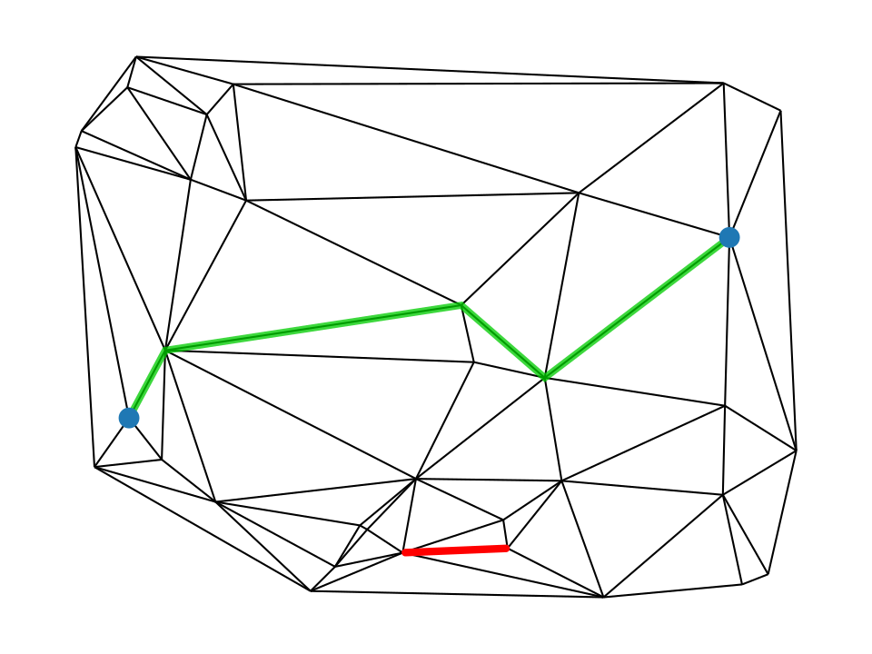{ width=30% }

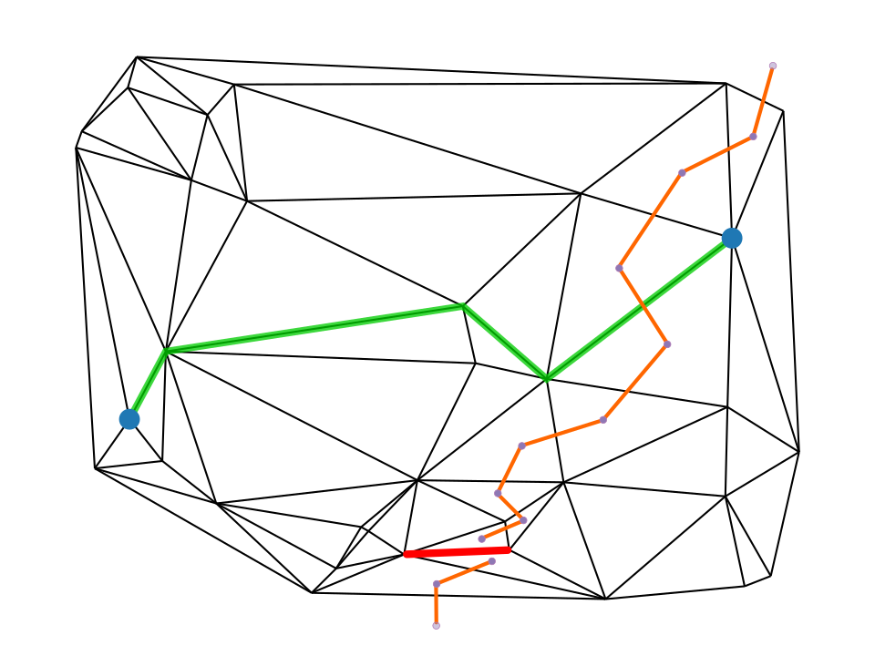{ width=30% }
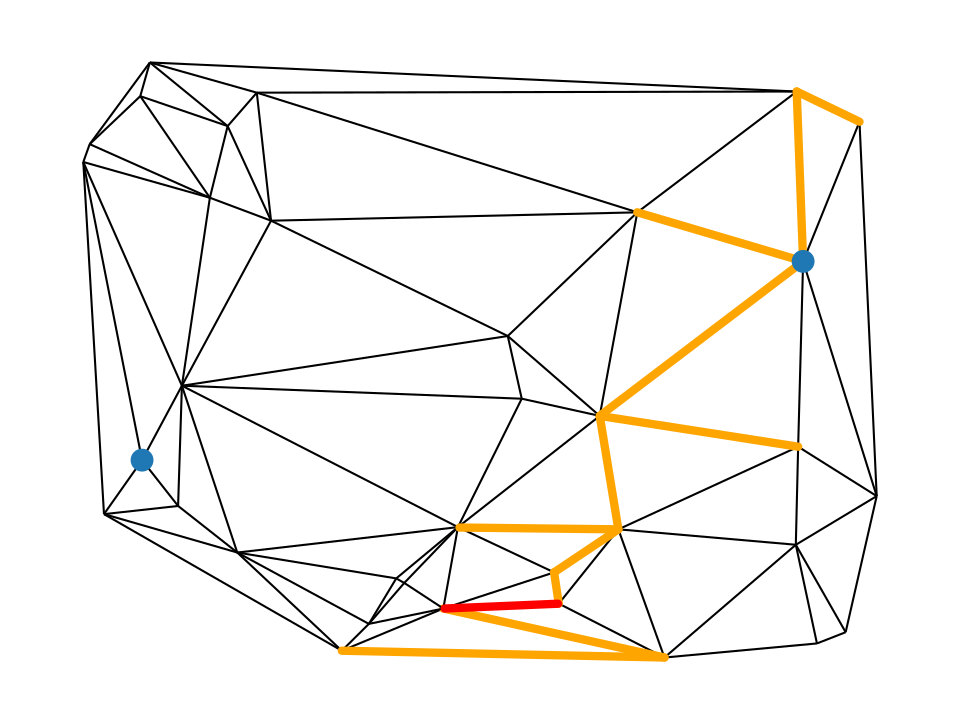{ width=30% }
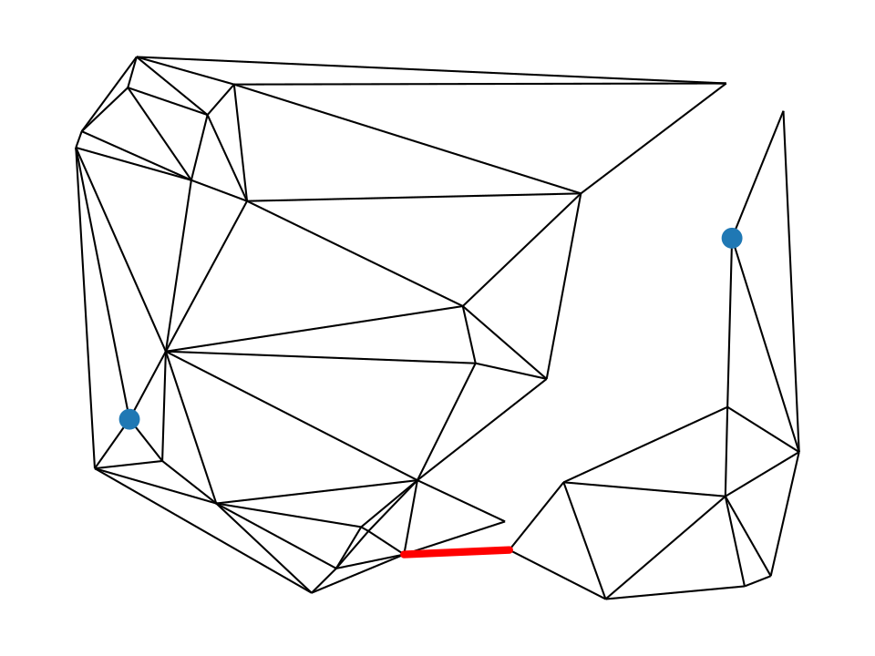{ width=30% }

# Diverse cuts

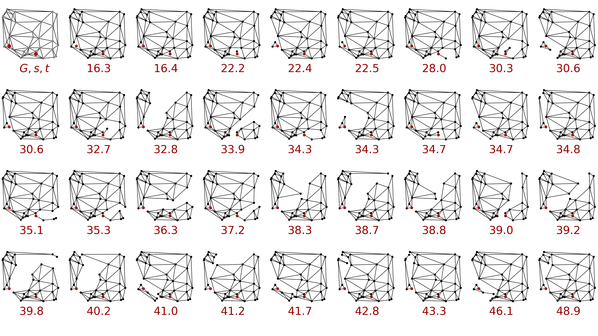{ width=100% }
